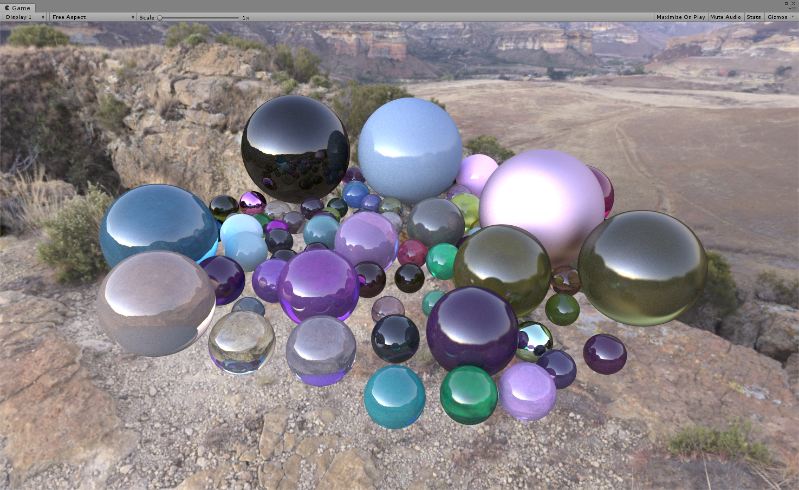
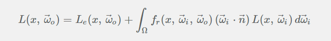
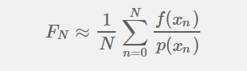
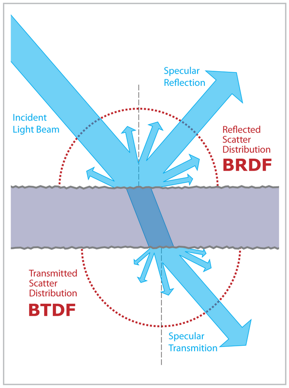
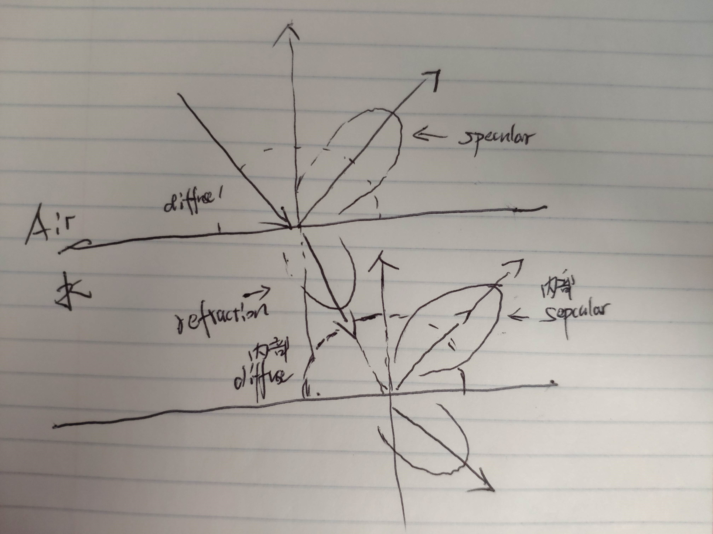
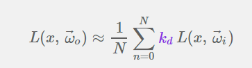
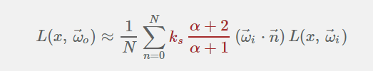
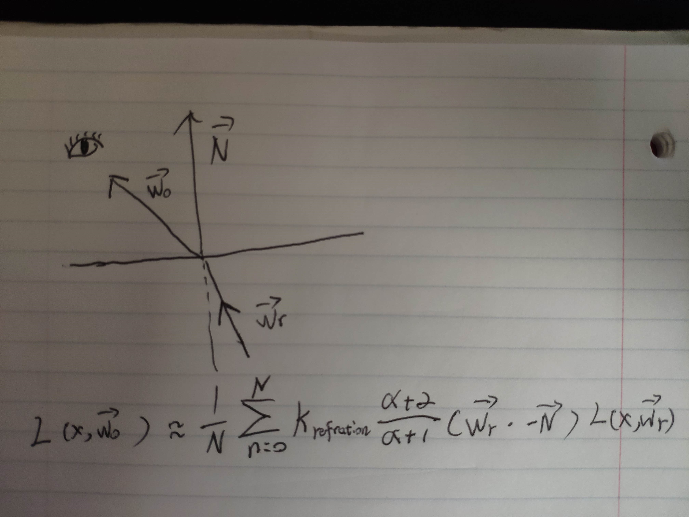

# Monte Carlo Path Tracer in Unity3D using compute shader

Unity 2018.3.7f1 (win10 64-bit)

## Features:
1. Path Tracing Rendering based on Monte Carlo integration
2. Emprical BRDF and BTDF
3. Diffuse, specular, refraction, Fresnel
4. Hemisphere Sampling, importance sampling
5. Fuzzy glassy ball

## Principle:   

### Rendering Equation    
 
### Monte Carlo Integration   
 
### BSDF = BRDF + BTDF
   
### Energy Distribution 
  
### BRDF and importance sampling   
#### Importance-Sampling Lambert    
    
#### Importance-Sampling Phong   
  

### BTDF and importance sampling
#### Importance-Sampling Phong for refraction 
  

## Reference:
[GPU Path Tracing in Unity – Part 2](http://three-eyed-games.com/2018/05/12/gpu-path-tracing-in-unity-part-2/)    
[Rendering Equation](http://www.cse.chalmers.se/edu/year/2011/course/TDA361/2007/rend_eq.pdf)   
[Monte Carlo Methods in Practice](https://www.scratchapixel.com/lessons/mathematics-physics-for-computer-graphics/monte-carlo-methods-in-practice/monte-carlo-methods)   
[蒙特·卡罗(Monte Carlo)积分详解](https://www.qiujiawei.com/monte-carlo/)    
[Using the Modified Phong Reflectance Model for Physically Based Rendering (1994)](http://mathinfo.univ-reims.fr/IMG/pdf/Using_the_modified_Phong_reflectance_model_for_Physically_based_rendering_-_Lafortune.pdf)   
[Uniform Sampling on unit Hemisphere](https://blog.thomaspoulet.fr/uniform-sampling-on-unit-hemisphere/)   
[Generating uniformly distributed numbers on a sphere](http://corysimon.github.io/articles/uniformdistn-on-sphere/)   
[Reflection, Refraction (Transmission) and Fresnel](https://www.scratchapixel.com/lessons/3d-basic-rendering/introduction-to-shading/reflection-refraction-fresnel)    
[Webgl中采用PBR的实时光线追踪](https://zhuanlan.zhihu.com/p/58692781)   
[Image-based rendering of spatially-varying BSDF](https://www.researchgate.net/publication/241177980_Image-based_rendering_of_spatially-varying_BSDF)
